# Лабораторная работа №1
## `Greeting`

### Ввод имени и возраста -> вывод имя + возраст в следующем году
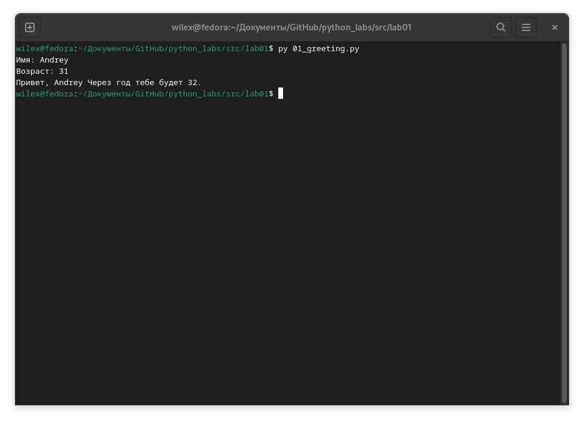
## `Sum avg`
### Ввод 2 числа с плавающей запятой -> вывод среднее аримфетическое двух чисел до двух знаков после запятой 
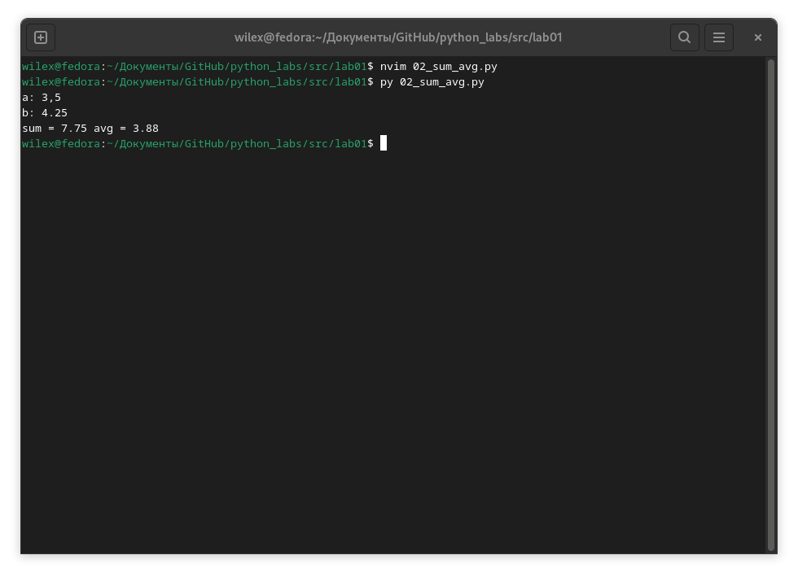
## `Discount vat`
### Ввод 3 числа с плавающей запятой (стоимость, скидка, ндс) -> вывод таблица с расчётами

## `Minutes to HH:MM`
### Ввод время в минутах -> вывод формат hh:mm
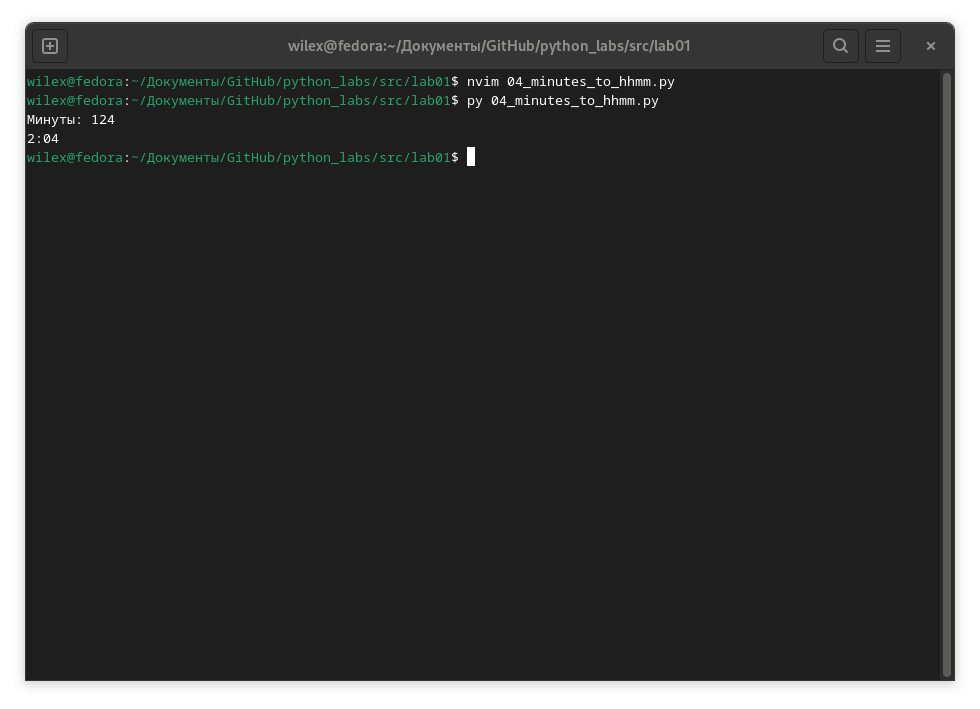
## `Initials and length`
### Ввод строка инициалов -> вывод корректные инициалы без лишних пробелов + длина
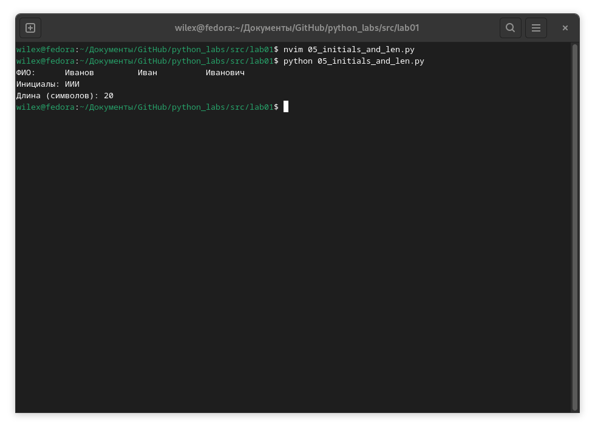
## `6 ex`
### Ввод произвольного количества строк формата: `ФИО True-False (формат обучения)` -> вывод колчество очников / заочников
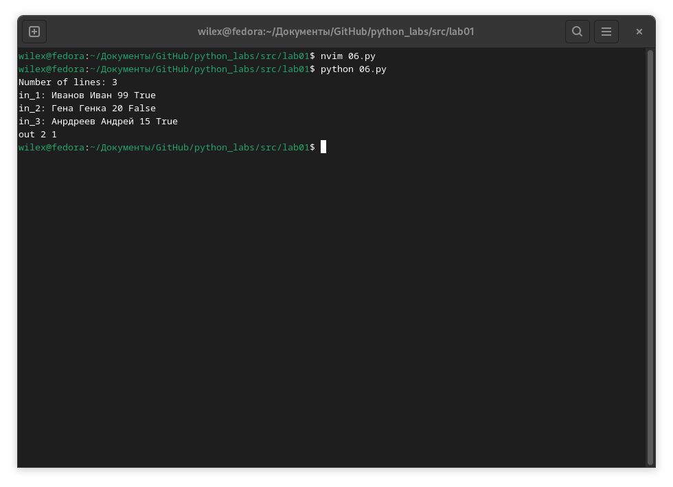
## `7 ex`
### Ввод строка -> вывод обработанная строка по указанному алгоритму
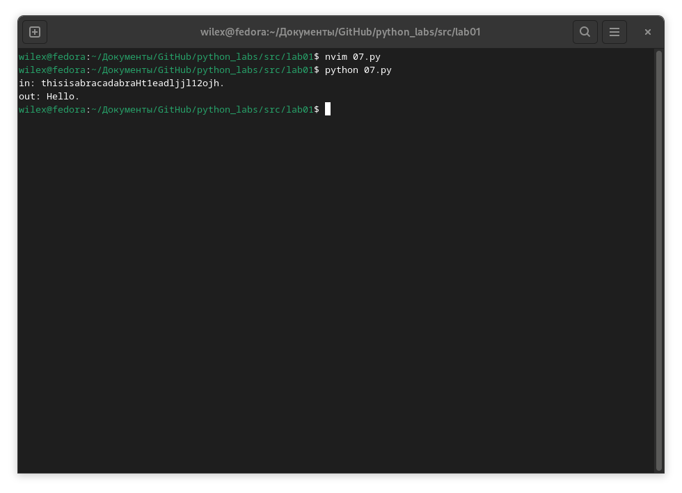
-----------
# Лабораторная работа №2
## `Arrays`
### min_max -> вывод минимального / макимального значения списка / кортежа
### unique_sorted -> вывод списка уникальных значений
### flatten -> вывод одномерного массива из двумерного

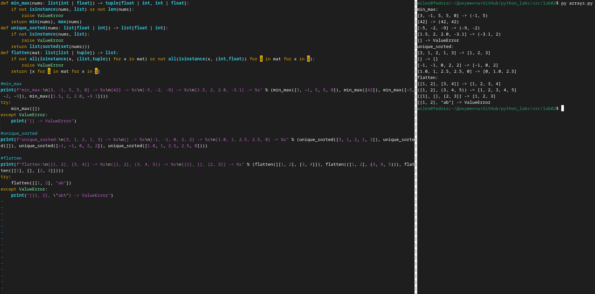

## `Matrix`
### transpose -> вывод двумерного массива с поменянными местами строками и столбцами
### row_sums -> вывод массива суммы строк двумерного массива
### col_sums -> вывод массива суммы столбцов двумерного массива
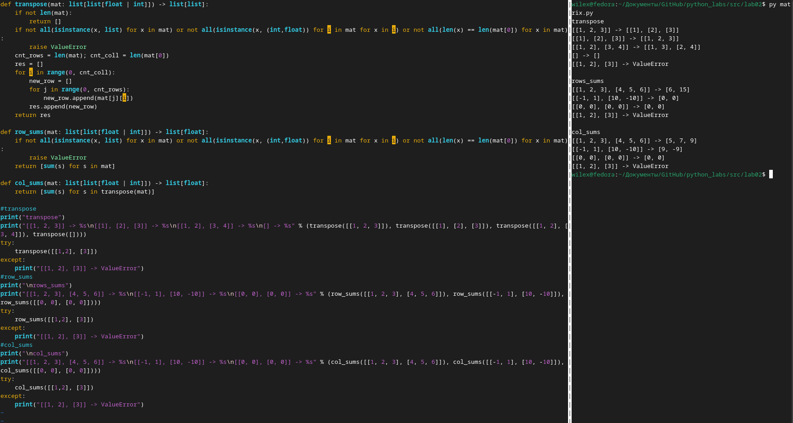

## `Tuples`
### format_record -> вывод строки в нужном формате + проверки
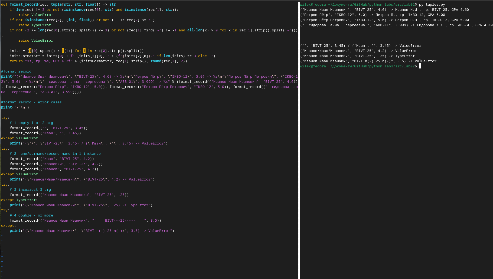

**⚠️ WARNING:** Возможна ошибка в каждой из функций при передаче в качестве аргумента некорректный тип данных, пустой список/кортеж
-----------
# Лабораторная работа №3
## `Normalize`
### Ввод строка -> вывод 'причёсанная' строка под определённым условиям

## `Tokenize`
### Ввод строка -> вывод список слов полученных путём вычленения слов из строки
## `CountFreq  + TopN`
### Ввод списк строк -> вывод словарь формата `слово:частота` ограниченный по необходимой длине + сортировка ↓частота ↑символ
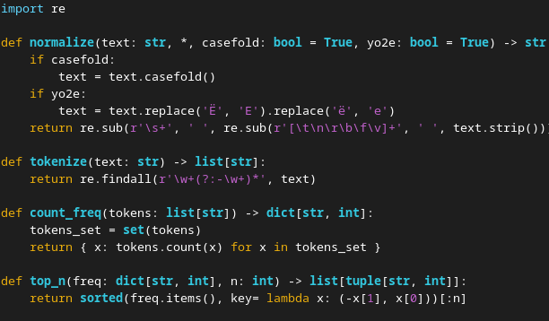
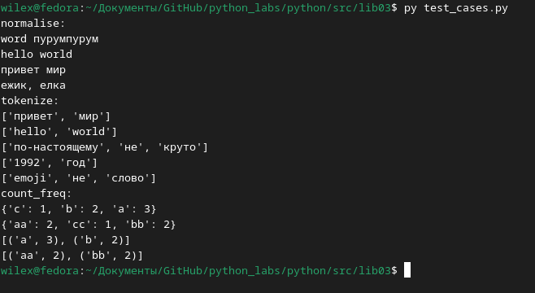
## Ввод через консоль строки в поток ввода, использованее функций выше и вывод в виде таблицы
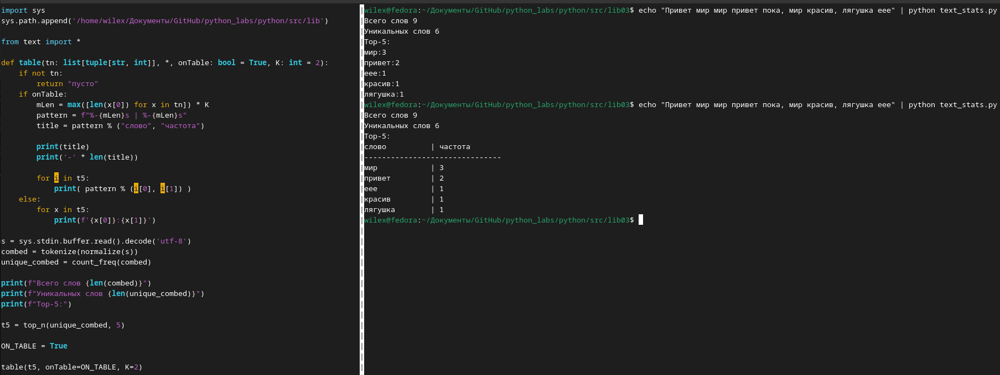
-----------
# Лабораторная работа №4
## `read_text`
### Ввод путь к файлу + кодировка -> вывод прочитанная строка

## `write_csv`
### Ввод список строк, путь и заголовк при необходимости -> запись в *.csv файл данных
## `ensure_parent_dir` 
### Ввод путь содержащий вложенные директории -> создание директорий
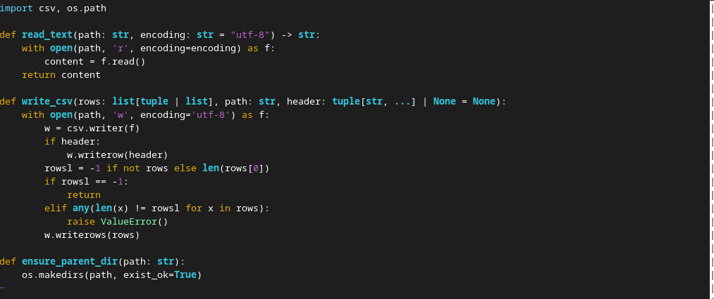
## `Тест этого файла`
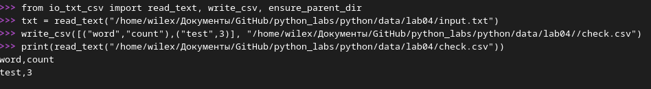

## `text_report.py`
## Первые 30 строк кода задействованы в проверке файлов (при запуске программы без аргументов программа отрабатывает в режиме одного файла со стандартными путями)
## Остальные строки кода задействованы в чтении и выводе в зависимости от количества переданных файлов(много либо 1)
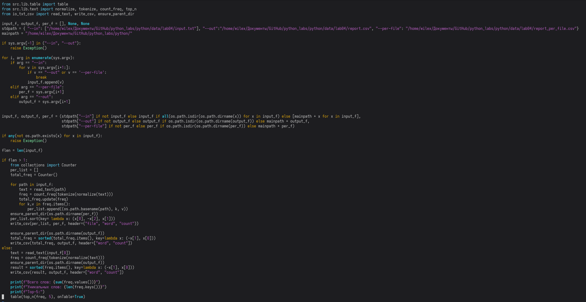
## `Вывод report.csv при работе с одним файлом`
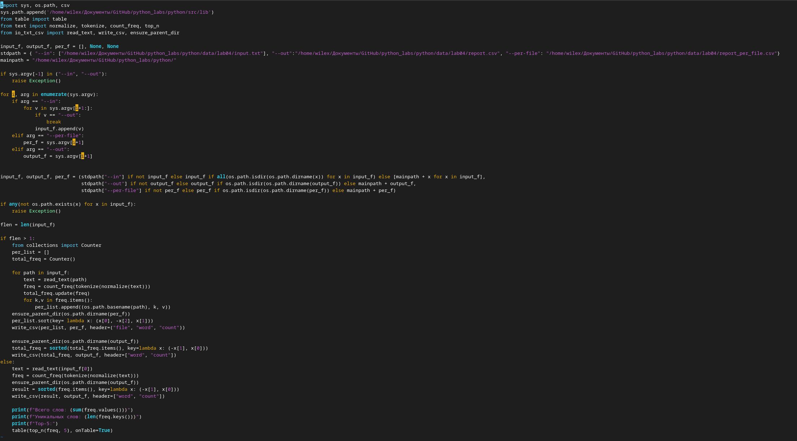
## `Вывод report_total.csv и report_per.csv при работе с 2 и более файлмаи`
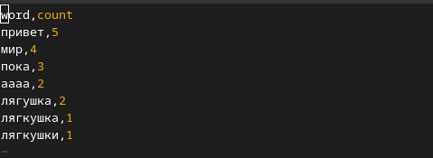
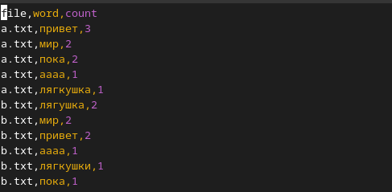
