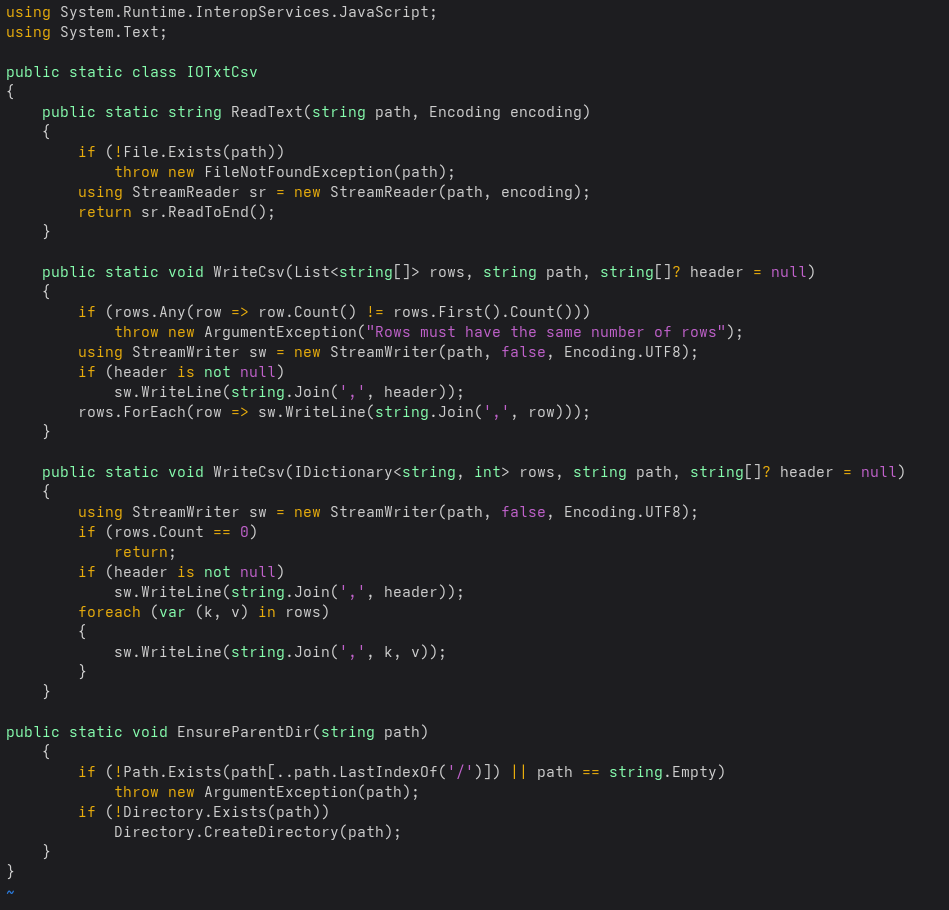
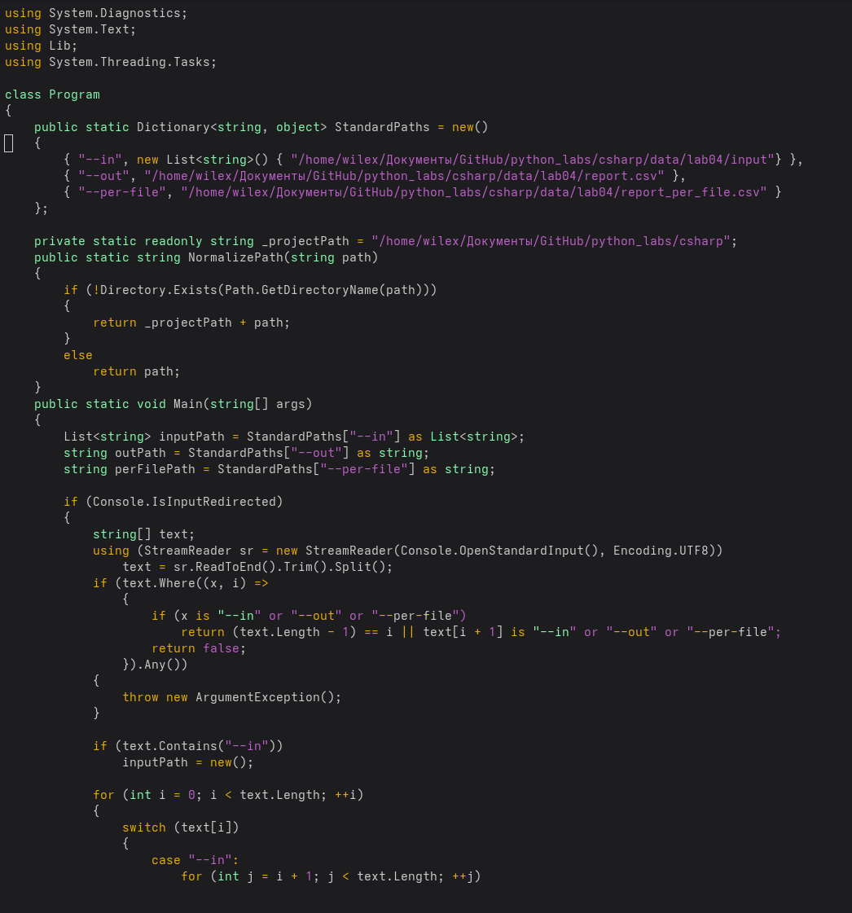
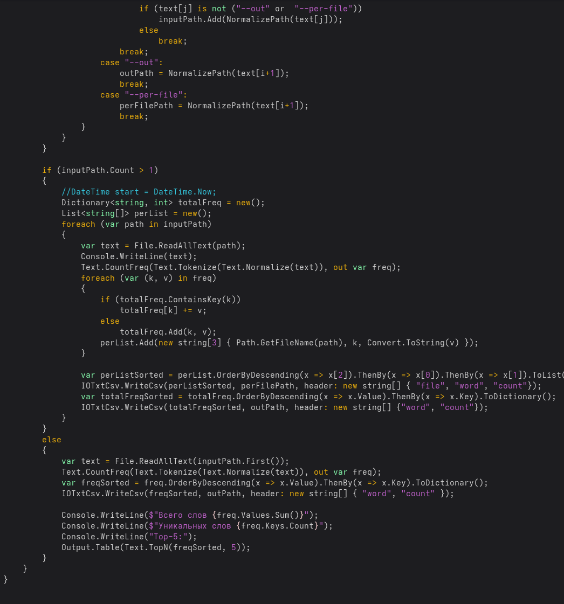
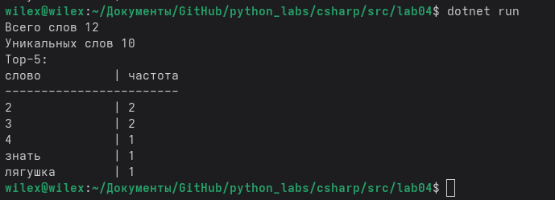
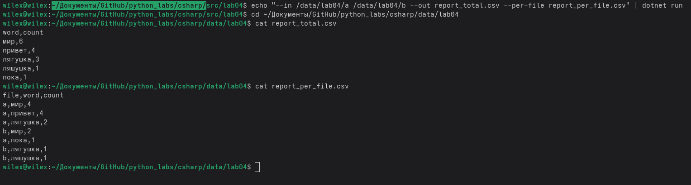

# Лабораторная работа №4
## `IOTxtCsv.ReadText`
### Ввод путь к файлу + проверка -> вывод прочитанная строка

## `IOTxtCsv.WriteCsv`
### Ввод список строк, путь и заголовк при необходимости -> запись в *.csv файл данных + проверки
## `IOTxtCsv.EnsureParentDir`
### Ввод путь к директории -> создание директорий

## `text_report.py`
## Разбивка путей + проверки если программа запускается без аргументов в поток ввода то запускается со стандартным набором параметров, если же 1 аргумент в поток ввода то работа с одним файлом + вывод в report.csv, с 2 и более создается report_per_file.csv и report_total.csv

## `Вывод report.csv при работе с одним файлом`

## `Вывод report_total.csv и report_per.csv при работе с 2 и более файлмаи`
