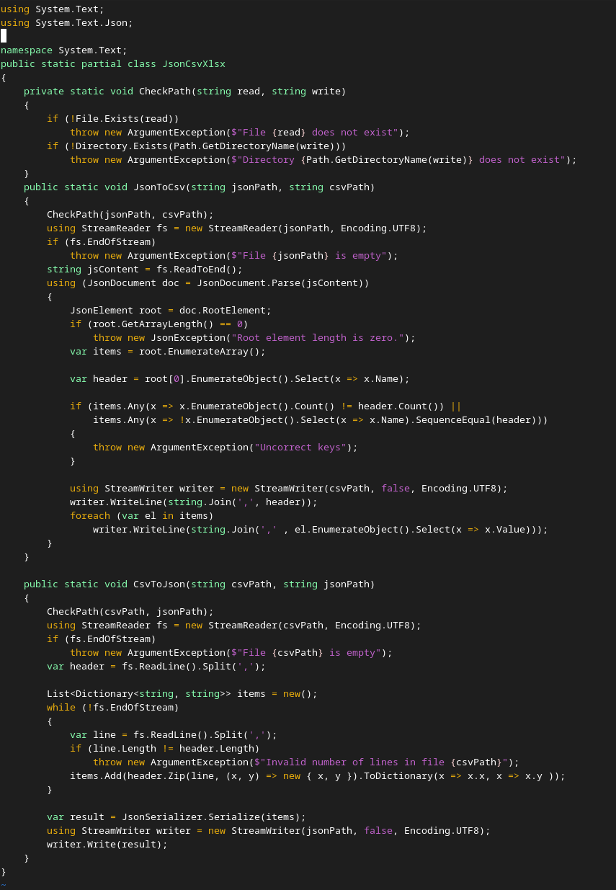
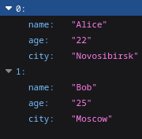
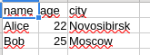
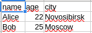
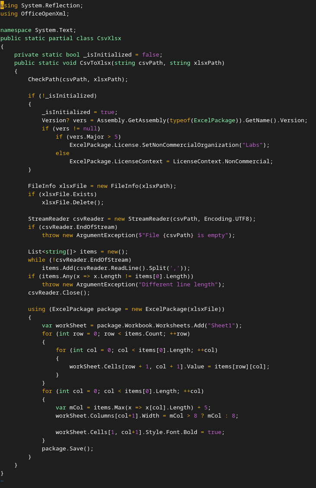
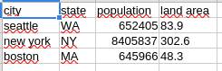
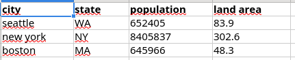

# Лабораторная работа №5
## `JsonCsv.cs` 
### Проверяем есть ли json файл и директорию с csv файлом. Проверяем пустой ли файл, вычлиняем заголовок, проверяем на одинаковое количество элементов в строке и на одинаковый заголовок. Построчно записываем получившиеся элементы в файл

## JSON -> CSV

## CSV -> JSON

## `CsvXlsx.cs`
### Для записи в .xlsx файл используется библиотека `EPPlus`

## CSV -> XLSX

