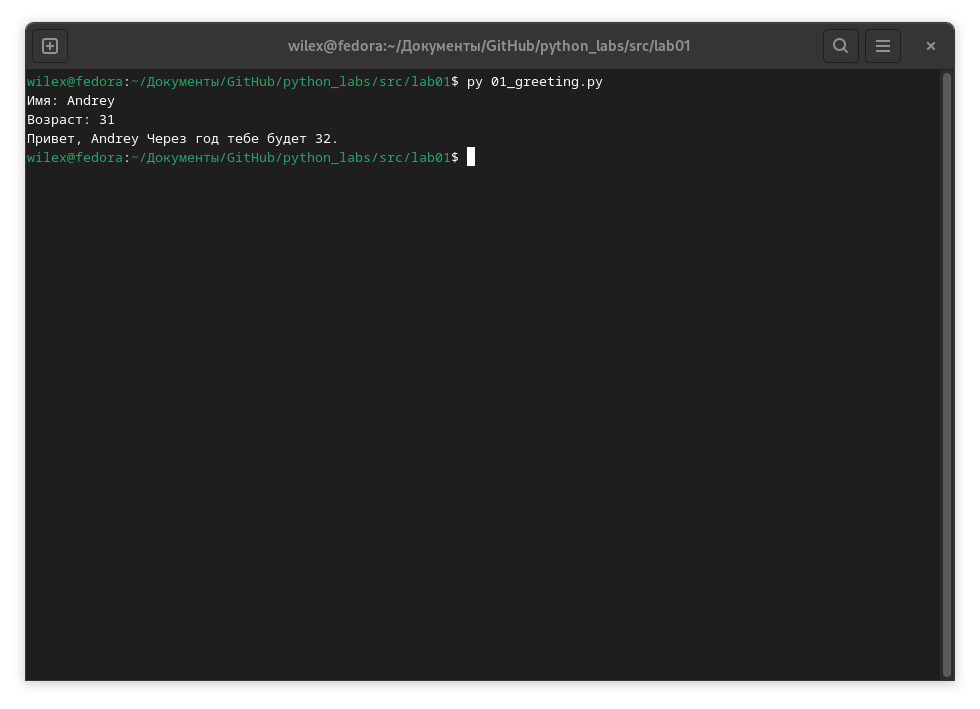
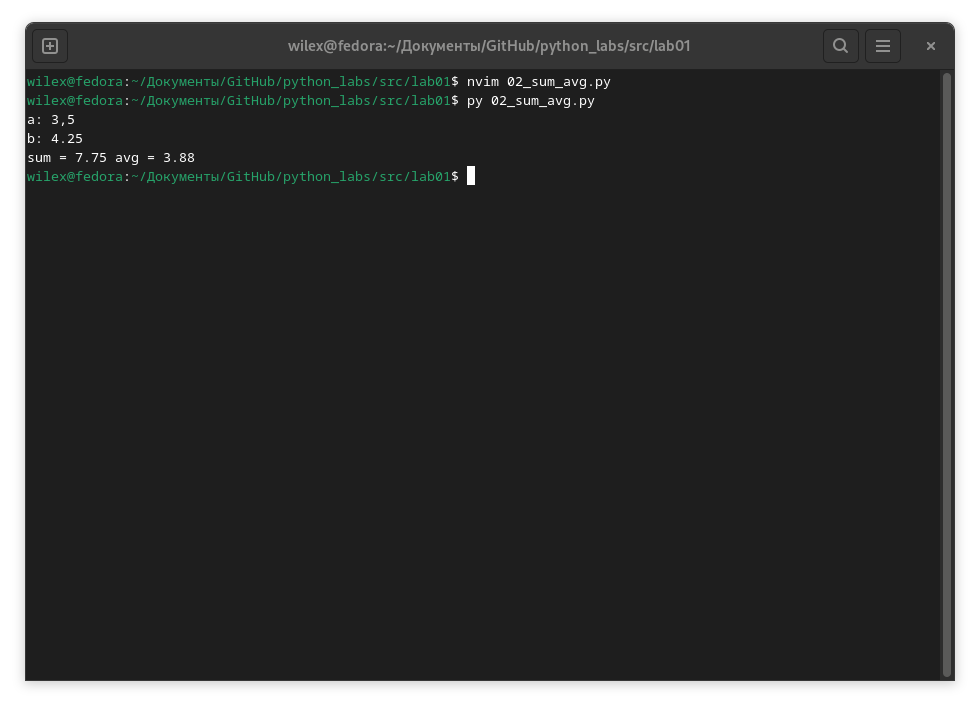
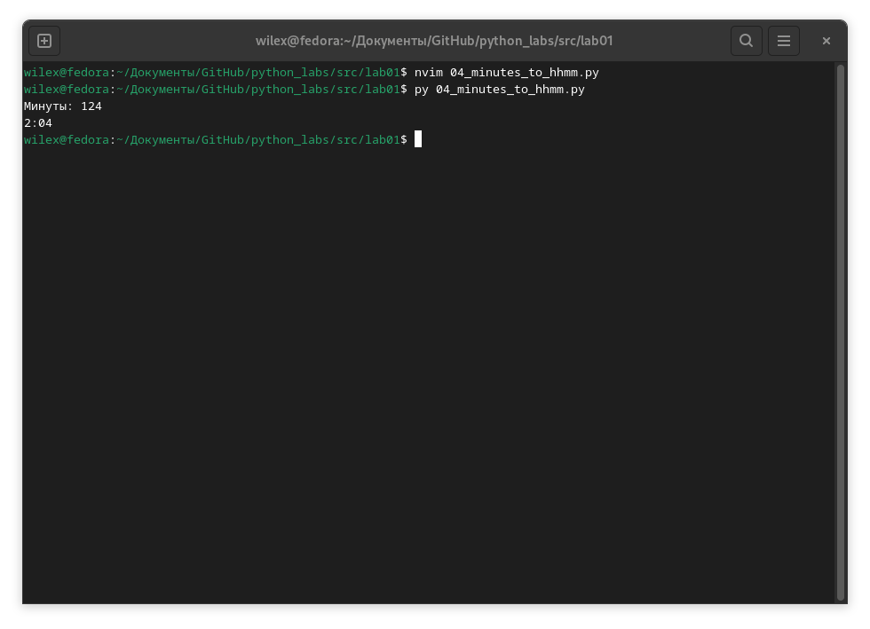
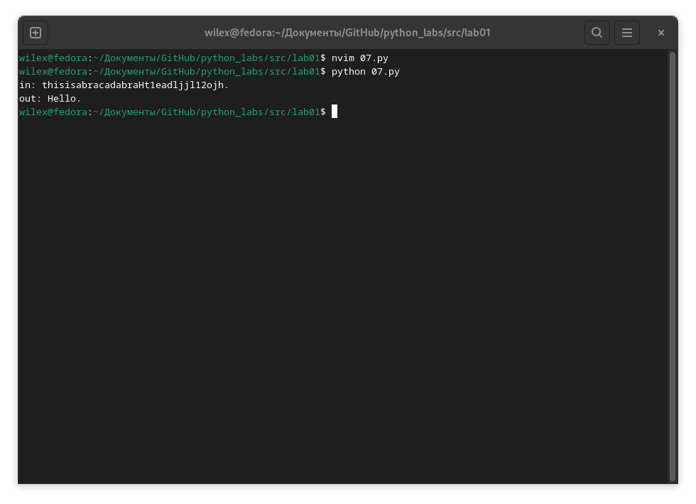

# Лабораторная работа №1
## `Greeting`

### Ввод имени и возраста -> вывод имя + возраст в следующем году

## `Sum avg`
### Ввод 2 числа с плавающей запятой -> вывод среднее аримфетическое двух чисел до двух знаков после запятой 

## `Discount vat`
### Ввод 3 числа с плавающей запятой (стоимость, скидка, ндс) -> вывод таблица с расчётами

## `Minutes to HH:MM`
### Ввод время в минутах -> вывод формат hh:mm

## `Initials and length`
### Ввод строка инициалов -> вывод корректные инициалы без лишних пробелов + длина

## `6 ex`
### Ввод произвольного количества строк формата: `ФИО True-False (формат обучения)` -> вывод колчество очников / заочников

## `7 ex`
### Ввод строка -> вывод обработанная строка по указанному алгоритму

