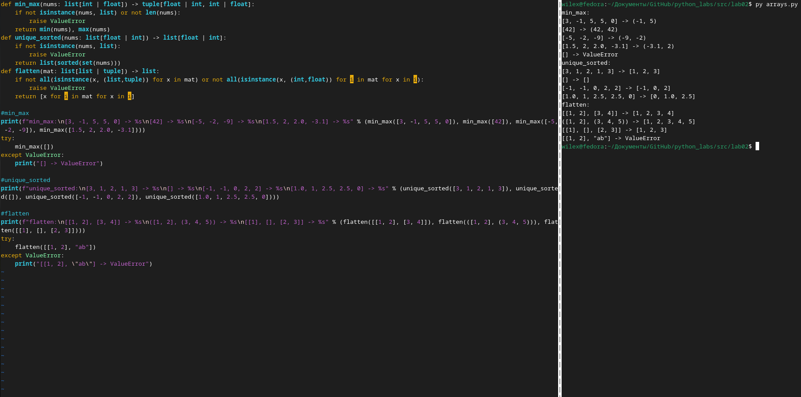
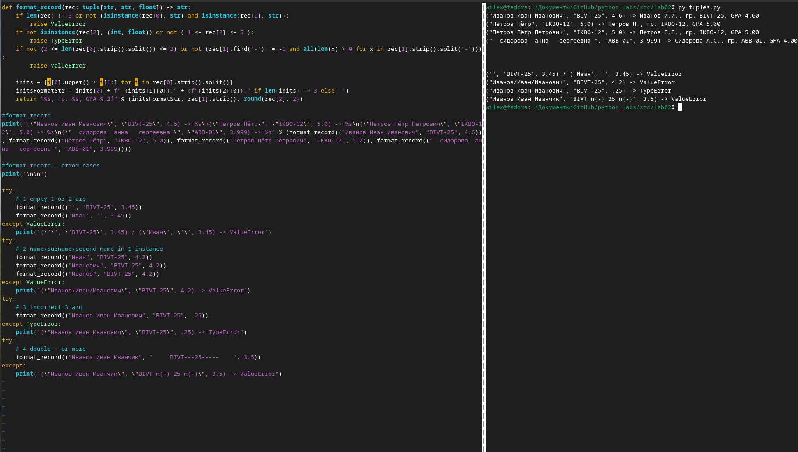

# Лабораторная работа №2
## `Arrays`
### min_max -> вывод минимального / макимального значения списка / кортежа
### unique_sorted -> вывод списка уникальных значений
### flatten -> вывод одномерного массива из двумерного

# Matrix
### transpose -> вывод двумерного массива с поменянными местами строками и столбцами
### row_sums -> вывод массива суммы строк двумерного массива
### col_sums -> вывод массива суммы столбцов двумерного массива

# Tuples
### format_record -> вывод строки в нужном формате + проверки

**⚠️ WARNING:** Возможна ошибка в каждой из функций при передаче в качестве аргумента некорректный тип данных, пустой список/кортеж
