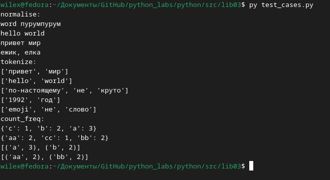
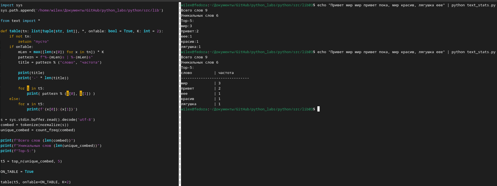

## `Normalize`
### Ввод строка -> вывод 'причёсанная' строка под определённым условиям

## `Tokenize`
### Ввод строка -> вывод список слов полученных путём вычленения слов из строки
## `CountFreq  + TopN`
### Ввод списк строк -> вывод словарь формата `слово:частота` ограниченный по необходимой длине + сортировка ↓частота ↑символ

## Ввод через консоль строки в поток ввода, использованее функций выше и вывод в виде таблицы

