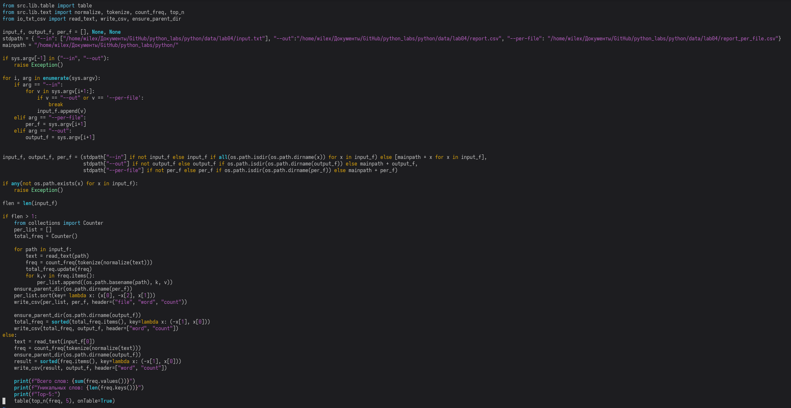
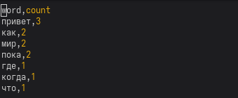
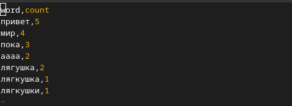
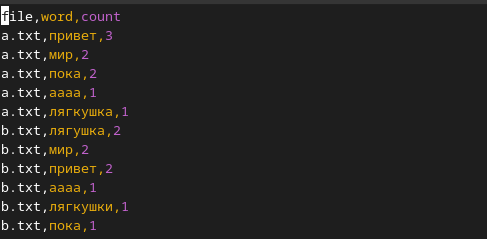

# Лабораторная работа №4
## `read_text`
### Ввод путь к файлу + кодировка -> вывод прочитанная строка

## `write_csv`
### Ввод список строк, путь и заголовк при необходимости -> запись в *.csv файл данных
## `ensure_parent_dir` 
### Ввод путь содержащий вложенные директории -> создание директорий

## `Тест этого файла`

## `text_report.py`
## Первые 30 строк кода задействованы в проверке файлов (при запуске программы без аргументов программа отрабатывает в режиме одного файла со стандартными путями)
## Остальные строки кода задействованы в чтении и выводе в зависимости от количества переданных файлов(много либо 1)

## `Вывод report.csv при работе с одним файлом`

## `Вывод report_total.csv и report_per.csv при работе с 2 и более файлмаи`

