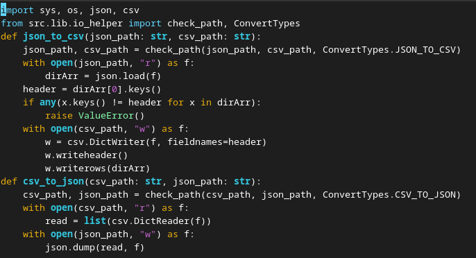
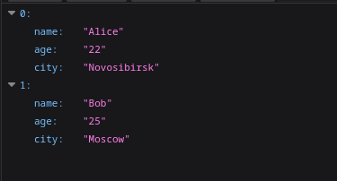
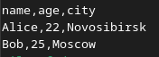
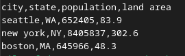
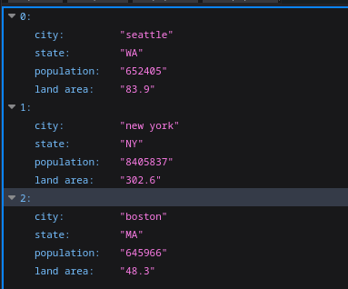
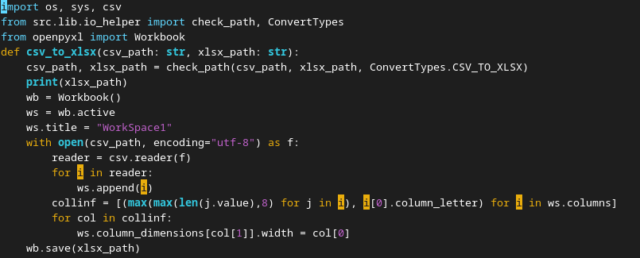
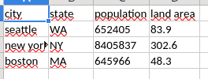

# Лабораторная работа №5
## `json_to_csv`
### Проверяем есть ли json файл и директорию с csv файлом. Проверяем пустой ли файл, вычлиняем заголовок, проверяем на принадлежность к типу файла. Построчно записываем получившиеся элементы в файл

## `csv_to_json`

## `csv_to_xlsx`
### Для работы с *.xlsx файлом используется библиотека `openpyxl`. Проверки + установка минимальной ширины колонок и сама запись в файл

