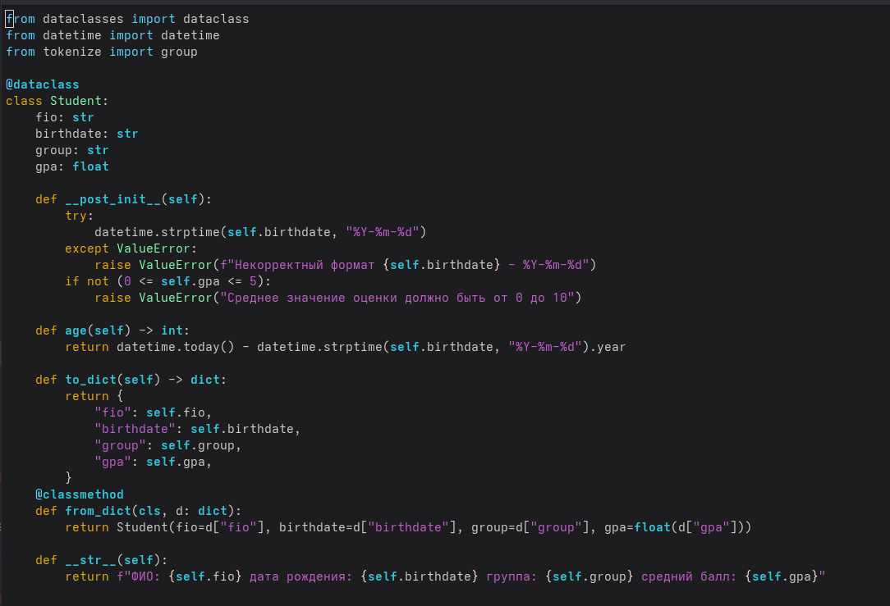
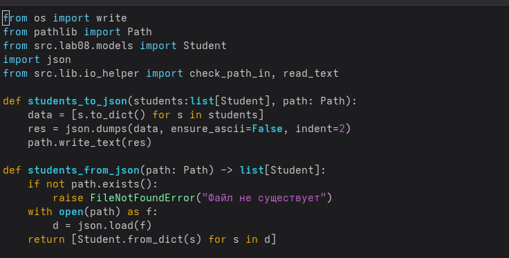

# Лабораторная работа №8
## `models.py`
## class Student
### post_init() - выполняет необходимые проверки после выполнения конкструкторра init() который инициализирует атрибуты объекта
### age() - метод, возвращающий текущий возраст студента
### to_dict() - метод, возвращающий набор атрибутов и их значений в виде словаря
### from_dict() - метод, возвращающий объект класса Student из набора атрибутов и их значений
### str() - метод, возвращающий строковое представление объекта

## `serialize.py`
### students_to_json() - функция, преобразующая набор атрибутов и их значений в json и записывающая этот json в файл
### students_from_json() - функция, преобразующая json в набор объектов student
