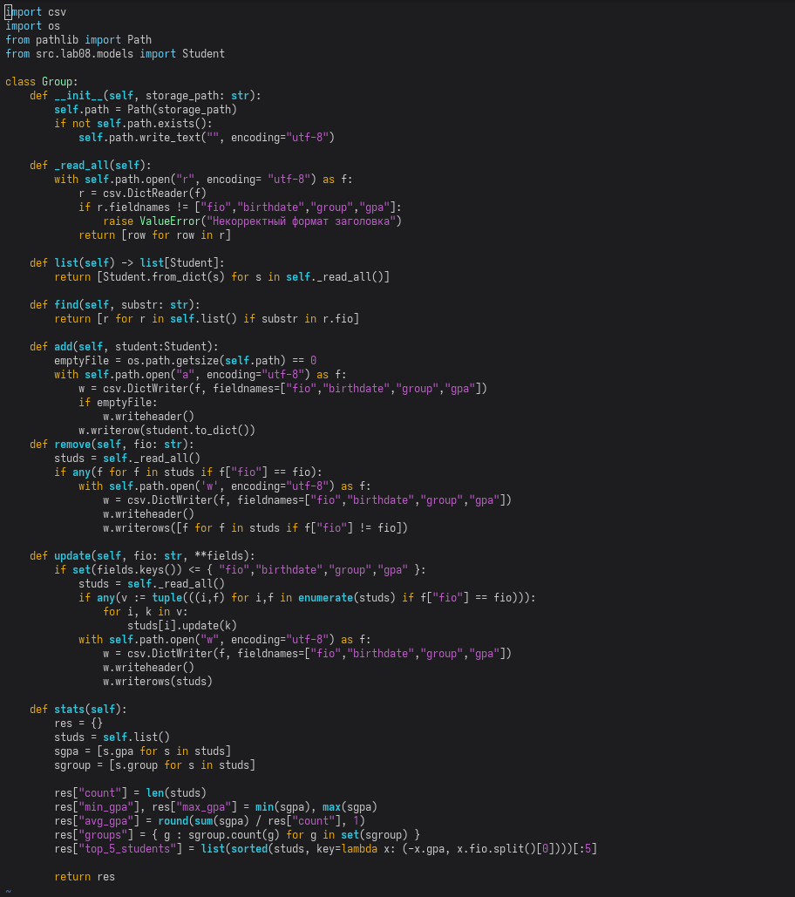

# Лабораторная работа №9
## class Group
## init() - конструктор с аргументом пути к набору студентов в формате csv + проверки
## _read_all() - protected-метод для чтения файла и получения словаря студентов с целью упрощения и вынесения повторяющегося кода в отдельный метод внутреннего использования
## list() - получение набора студентов из файла
## find() - метод, возвращающий набор студентов, фамилия которых удволетворяет определённой подстроке
## add() - метод, добавляющий в конец набора студентов ещё одного студента, для этого файл открывается с флагом append
## remove() - метод, удаляющий элементы, фио которых соответсвует переданному
## stats() - метод, возвращающий словарь статистических данных группы

