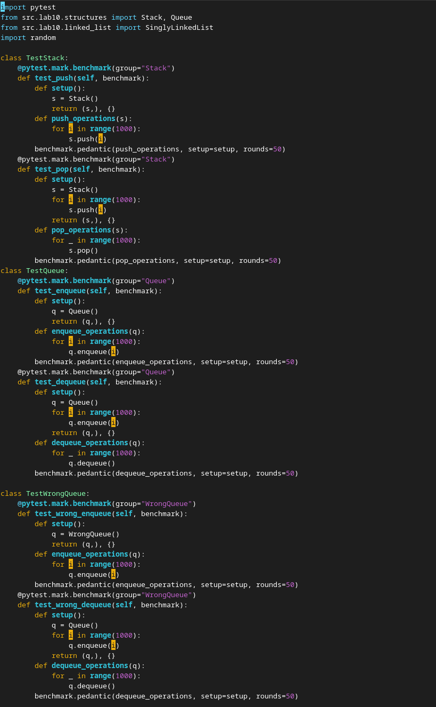
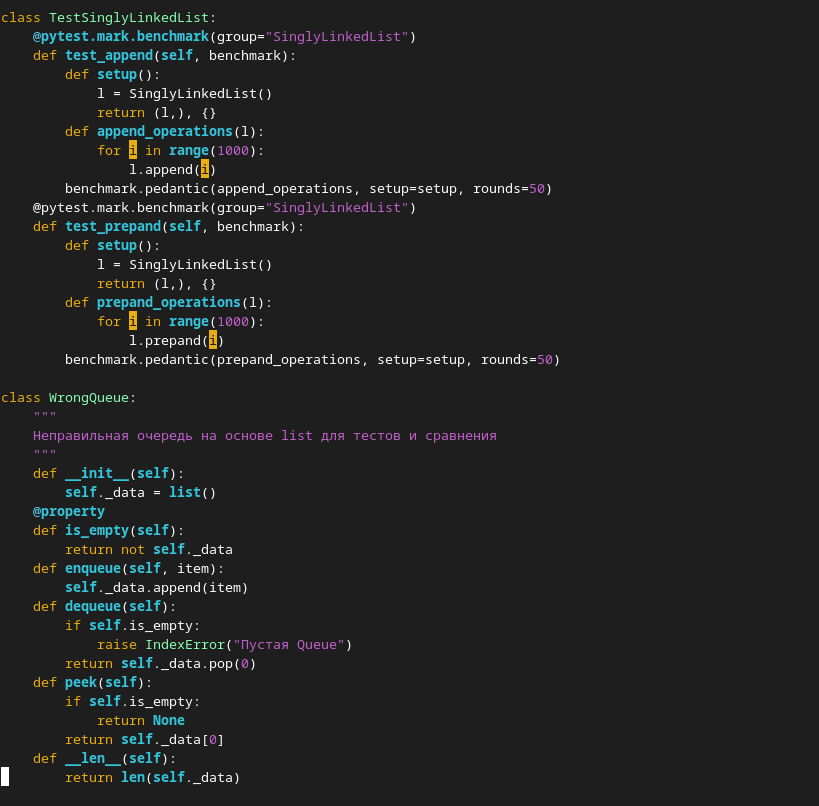

# Лабораторная работа №10
## `structures.py`
### class Stack - коллекция, работающая по принципу LIFO (_last in first out_) - соответственно основная работа производится над верхушкой стека, куда мы как добавляем элементы, удаляем и забираем, соответсвенно реализуется на основе списка. Концептуально реализует фундаментальный принцип хранения переменных на стеке и порядок выхода из него
### Оснвоные операции:
* **push** - метод добавления элемента в конец коллекции
* **pop** - метод удаления элемента с конца коллекции
* **peek** - метод, возвращающий вершинный элемент стека

****
### class Queue - коллекция, работающая по принципу FIFO (_first in first out_) - соответственно основная работа связана с началом коллекции, поэтому реализуетася на основе deque который реализуется на основе кусочных, связанных коллекций определённой длины, лежащих в куче произвольным образов 
### Оснвоные операции:
* **enqueue** - метод добавление элемента в начало коллекции
* **dequeue** - метод удаление получения и удаления элемента с начала коллекции
* **peek** - метод, возвращающий первого в очереди

****
### class SingleLinkedList - коллекция, основанная на связанных последовательно элементах Node, которые хранят в себе указатель на следующий элемент коллекции и значение текущего Node
### Оснвоные операции:
* **append** - метод, добавляющий элемент в конец односвязного списка
* **prepand** - метод, добавляющий элемент в начало
* **insert** - метод, добавляющий элемент на произвольную позицию, изменяя указатель предыдущего элемента

****

### Бенчмарк
### Кроме основных коллекций был произведён тест очереди на основе list

